Introduction to GeoPandas
=============================

<a id='Table-of-Contents'></a>
Table of Contents
------------------
 - [Requesting a dataset remotely](#requestfileremotely)
 - [Supported filetypes geopandas will open](#supported_drivers)
 - [Inspect file returned from remote](#inspectfile)
 - [Pandas to GeoPandas: the GeoSeries and GeoDataFrame](#pan2geo)
 - [GeoSeries attributes](#geoseriesattrib)
  - [area](#area)
  - [bounds](#bounds)
  - [area, bounds, is_valid, crs, and centroid use examples](#otheruseexamples)
 - [Toward mapping: a basic GeoPandas workflow](#workflow)
  - [supported drivers for to_file](#drivers)
  - [write to shapefile](#writeshape)
  - [write to geojson](#writegeojson)
 - [Plotting geospatial data](#plotgeo)
  - [make sub-selections of a DataFrame](#subselections)
  - [write sub-selection to shapefile](#writesubselect)
  - [read shapefile](#readshape1)
  - [check if json data file exist and delete if exist](#checkfile)
  - [write geojson](#writegeojson2)
  - [set X and Y axis limits with Matplotlib](#setxyaxis)
 - [Adjusting/managing projections](#adjustproj)
  - [create a new GeoDataFrame of Portugal](#sliceportugal)
  - [set dataframe to new projection](#setprojection)
  - [plot Portugal](#plotportugal)
  - [add the europe GeoDataFrame as the basemap](#baseeurope)

***

#### Additional Examples
 - [Adding a background tile map to plots](#tilemaps)
 - [Plotting with Geoplot](#plotgeoplot)
  - [use size as a visual variable using cartogram](#cartogram)
  - [use color as a visual variable - specify choropleth](#chloropleth)
  - [re-project data into any of the map projections provided by CartoPy](#cartopy) 
 - [Aggregate geometric features - dissolve function](#dissolve)
  - [aggregate the geodataframe by continents](#aggcontinent)
  - [plot the new geodataframe](#plotnewgeo)
  - [add color based on the pop_est for each continent; display legend to the right of the plot-legend_kwds](#displegend)
 - [Creating a GeoDataFrame from a DataFrame with coordinates](#Creating_GeoDataFrame_DataFrame_with_coordinates)
  - [create a Shapely object for geodataframe](#GeoDataFrame_needs_shapely_object)
  - [transform tuples to Point](#transform_tuples)
  - [create the GeoDataFrame](#CreateGeoDataFrame)
  - [plot geodataframe coordinates](#plot_geodataframe)
  - [plot a specific column](#plot_column)


***


```python
%matplotlib inline

import pandas as pd
import geopandas as gpd
import geoplot
import fiona
import os
```

<a id='requestfileremotely'></a>
#### Request a dataset from a remote server
A packed archive collection of Shapefiles contained within a .zip file.


```python
countries_raw = gpd.read_file('https://www.naturalearthdata.com/http//www.naturalearthdata.com/download/50m/cultural/ne_50m_admin_0_countries.zip')
```

<a id='supported_drivers'></a>
#### For a __list of supported drivers__ geopandas (fiona) will open, use the following command:
`fiona.supported_drivers`

<a id='inspectfile'></a>
#### Inspect the object returned from read_file()


```python
type(countries_raw)
```


    geopandas.geodataframe.GeoDataFrame


```python
countries_raw.info()
```

    <class 'geopandas.geodataframe.GeoDataFrame'>
    RangeIndex: 241 entries, 0 to 240
    Data columns (total 95 columns):
    featurecla    241 non-null object
    scalerank     241 non-null int64
    LABELRANK     241 non-null int64
    SOVEREIGNT    241 non-null object
    SOV_A3        241 non-null object
    ADM0_DIF      241 non-null int64
    LEVEL         241 non-null int64
    TYPE          241 non-null object
    ADMIN         241 non-null object
    ADM0_A3       241 non-null object
    GEOU_DIF      241 non-null int64
    GEOUNIT       241 non-null object
    GU_A3         241 non-null object
    SU_DIF        241 non-null int64
    SUBUNIT       241 non-null object
    SU_A3         241 non-null object
    BRK_DIFF      241 non-null int64
    NAME          241 non-null object
    NAME_LONG     241 non-null object
    BRK_A3        241 non-null object
    BRK_NAME      241 non-null object
    BRK_GROUP     3 non-null object
    ABBREV        241 non-null object
    POSTAL        241 non-null object
    FORMAL_EN     229 non-null object
    FORMAL_FR     5 non-null object
    NAME_CIAWF    229 non-null object
    NOTE_ADM0     44 non-null object
    NOTE_BRK      9 non-null object
    NAME_SORT     241 non-null object
    NAME_ALT      4 non-null object
    MAPCOLOR7     241 non-null int64
    MAPCOLOR8     241 non-null int64
    MAPCOLOR9     241 non-null int64
    MAPCOLOR13    241 non-null int64
    POP_EST       241 non-null int64
    POP_RANK      241 non-null int64
    GDP_MD_EST    241 non-null float64
    POP_YEAR      241 non-null int64
    LASTCENSUS    241 non-null int64
    GDP_YEAR      241 non-null int64
    ECONOMY       241 non-null object
    INCOME_GRP    241 non-null object
    WIKIPEDIA     241 non-null int64
    FIPS_10_      241 non-null object
    ISO_A2        241 non-null object
    ISO_A3        241 non-null object
    ISO_A3_EH     241 non-null object
    ISO_N3        241 non-null object
    UN_A3         241 non-null object
    WB_A2         241 non-null object
    WB_A3         241 non-null object
    WOE_ID        241 non-null int64
    WOE_ID_EH     241 non-null int64
    WOE_NOTE      241 non-null object
    ADM0_A3_IS    241 non-null object
    ADM0_A3_US    241 non-null object
    ADM0_A3_UN    241 non-null int64
    ADM0_A3_WB    241 non-null int64
    CONTINENT     241 non-null object
    REGION_UN     241 non-null object
    SUBREGION     241 non-null object
    REGION_WB     241 non-null object
    NAME_LEN      241 non-null int64
    LONG_LEN      241 non-null int64
    ABBREV_LEN    241 non-null int64
    TINY          241 non-null int64
    HOMEPART      241 non-null int64
    MIN_ZOOM      241 non-null float64
    MIN_LABEL     241 non-null float64
    MAX_LABEL     241 non-null float64
    NE_ID         241 non-null int64
    WIKIDATAID    241 non-null object
    NAME_AR       241 non-null object
    NAME_BN       238 non-null object
    NAME_DE       241 non-null object
    NAME_EN       241 non-null object
    NAME_ES       241 non-null object
    NAME_FR       241 non-null object
    NAME_EL       241 non-null object
    NAME_HI       240 non-null object
    NAME_HU       241 non-null object
    NAME_ID       241 non-null object
    NAME_IT       241 non-null object
    NAME_JA       241 non-null object
    NAME_KO       241 non-null object
    NAME_NL       241 non-null object
    NAME_PL       241 non-null object
    NAME_PT       241 non-null object
    NAME_RU       241 non-null object
    NAME_SV       241 non-null object
    NAME_TR       241 non-null object
    NAME_VI       241 non-null object
    NAME_ZH       241 non-null object
    geometry      241 non-null object
    dtypes: float64(4), int64(27), object(64)
    memory usage: 178.9+ KB
    


```python
countries_raw.describe()
```


<div>
<style scoped>
    .dataframe tbody tr th:only-of-type {
        vertical-align: middle;
    }

    .dataframe tbody tr th {
        vertical-align: top;
    }

    .dataframe thead th {
        text-align: right;
    }
</style>
<table border="1" class="dataframe">
  <thead>
    <tr style="text-align: right;">
      <th></th>
      <th>scalerank</th>
      <th>LABELRANK</th>
      <th>ADM0_DIF</th>
      <th>LEVEL</th>
      <th>GEOU_DIF</th>
      <th>SU_DIF</th>
      <th>BRK_DIFF</th>
      <th>MAPCOLOR7</th>
      <th>MAPCOLOR8</th>
      <th>MAPCOLOR9</th>
      <th>...</th>
      <th>ADM0_A3_WB</th>
      <th>NAME_LEN</th>
      <th>LONG_LEN</th>
      <th>ABBREV_LEN</th>
      <th>TINY</th>
      <th>HOMEPART</th>
      <th>MIN_ZOOM</th>
      <th>MIN_LABEL</th>
      <th>MAX_LABEL</th>
      <th>NE_ID</th>
    </tr>
  </thead>
  <tbody>
    <tr>
      <th>count</th>
      <td>241.000000</td>
      <td>241.000000</td>
      <td>241.000000</td>
      <td>241.0</td>
      <td>241.0</td>
      <td>241.000000</td>
      <td>241.000000</td>
      <td>241.000000</td>
      <td>241.000000</td>
      <td>241.000000</td>
      <td>...</td>
      <td>241.0</td>
      <td>241.000000</td>
      <td>241.000000</td>
      <td>241.000000</td>
      <td>241.000000</td>
      <td>241.000000</td>
      <td>241.000000</td>
      <td>241.000000</td>
      <td>241.000000</td>
      <td>2.410000e+02</td>
    </tr>
    <tr>
      <th>mean</th>
      <td>1.867220</td>
      <td>4.149378</td>
      <td>0.211618</td>
      <td>2.0</td>
      <td>0.0</td>
      <td>0.008299</td>
      <td>0.029046</td>
      <td>3.348548</td>
      <td>3.622407</td>
      <td>3.858921</td>
      <td>...</td>
      <td>-99.0</td>
      <td>8.908714</td>
      <td>10.082988</td>
      <td>5.041494</td>
      <td>-75.651452</td>
      <td>-16.012448</td>
      <td>0.085892</td>
      <td>3.684647</td>
      <td>8.531120</td>
      <td>1.159321e+09</td>
    </tr>
    <tr>
      <th>std</th>
      <td>1.316167</td>
      <td>1.432687</td>
      <td>0.409306</td>
      <td>0.0</td>
      <td>0.0</td>
      <td>0.090908</td>
      <td>0.168284</td>
      <td>1.815124</td>
      <td>1.909013</td>
      <td>2.184418</td>
      <td>...</td>
      <td>0.0</td>
      <td>4.213071</td>
      <td>6.073968</td>
      <td>1.496642</td>
      <td>43.030063</td>
      <td>37.652410</td>
      <td>0.677963</td>
      <td>1.069605</td>
      <td>1.155993</td>
      <td>3.354489e+02</td>
    </tr>
    <tr>
      <th>min</th>
      <td>1.000000</td>
      <td>2.000000</td>
      <td>0.000000</td>
      <td>2.0</td>
      <td>0.0</td>
      <td>0.000000</td>
      <td>0.000000</td>
      <td>1.000000</td>
      <td>1.000000</td>
      <td>1.000000</td>
      <td>...</td>
      <td>-99.0</td>
      <td>4.000000</td>
      <td>4.000000</td>
      <td>3.000000</td>
      <td>-99.000000</td>
      <td>-99.000000</td>
      <td>0.000000</td>
      <td>1.700000</td>
      <td>5.200000</td>
      <td>1.159320e+09</td>
    </tr>
    <tr>
      <th>25%</th>
      <td>1.000000</td>
      <td>3.000000</td>
      <td>0.000000</td>
      <td>2.0</td>
      <td>0.0</td>
      <td>0.000000</td>
      <td>0.000000</td>
      <td>2.000000</td>
      <td>2.000000</td>
      <td>2.000000</td>
      <td>...</td>
      <td>-99.0</td>
      <td>6.000000</td>
      <td>6.000000</td>
      <td>4.000000</td>
      <td>-99.000000</td>
      <td>1.000000</td>
      <td>0.000000</td>
      <td>3.000000</td>
      <td>8.000000</td>
      <td>1.159321e+09</td>
    </tr>
    <tr>
      <th>50%</th>
      <td>1.000000</td>
      <td>4.000000</td>
      <td>0.000000</td>
      <td>2.0</td>
      <td>0.0</td>
      <td>0.000000</td>
      <td>0.000000</td>
      <td>3.000000</td>
      <td>4.000000</td>
      <td>4.000000</td>
      <td>...</td>
      <td>-99.0</td>
      <td>8.000000</td>
      <td>8.000000</td>
      <td>5.000000</td>
      <td>-99.000000</td>
      <td>1.000000</td>
      <td>0.000000</td>
      <td>4.000000</td>
      <td>9.000000</td>
      <td>1.159321e+09</td>
    </tr>
    <tr>
      <th>75%</th>
      <td>3.000000</td>
      <td>6.000000</td>
      <td>0.000000</td>
      <td>2.0</td>
      <td>0.0</td>
      <td>0.000000</td>
      <td>0.000000</td>
      <td>5.000000</td>
      <td>5.000000</td>
      <td>6.000000</td>
      <td>...</td>
      <td>-99.0</td>
      <td>10.000000</td>
      <td>12.000000</td>
      <td>6.000000</td>
      <td>-99.000000</td>
      <td>1.000000</td>
      <td>0.000000</td>
      <td>4.500000</td>
      <td>9.500000</td>
      <td>1.159321e+09</td>
    </tr>
    <tr>
      <th>max</th>
      <td>6.000000</td>
      <td>7.000000</td>
      <td>1.000000</td>
      <td>2.0</td>
      <td>0.0</td>
      <td>1.000000</td>
      <td>1.000000</td>
      <td>7.000000</td>
      <td>8.000000</td>
      <td>9.000000</td>
      <td>...</td>
      <td>-99.0</td>
      <td>25.000000</td>
      <td>35.000000</td>
      <td>13.000000</td>
      <td>6.000000</td>
      <td>1.000000</td>
      <td>7.000000</td>
      <td>6.500000</td>
      <td>11.000000</td>
      <td>1.159321e+09</td>
    </tr>
  </tbody>
</table>
<p>8 rows × 31 columns</p>
</div>


```python
countries_raw.head()
```


<div>
<style scoped>
    .dataframe tbody tr th:only-of-type {
        vertical-align: middle;
    }

    .dataframe tbody tr th {
        vertical-align: top;
    }

    .dataframe thead th {
        text-align: right;
    }
</style>
<table border="1" class="dataframe">
  <thead>
    <tr style="text-align: right;">
      <th></th>
      <th>featurecla</th>
      <th>scalerank</th>
      <th>LABELRANK</th>
      <th>SOVEREIGNT</th>
      <th>SOV_A3</th>
      <th>ADM0_DIF</th>
      <th>LEVEL</th>
      <th>TYPE</th>
      <th>ADMIN</th>
      <th>ADM0_A3</th>
      <th>...</th>
      <th>NAME_KO</th>
      <th>NAME_NL</th>
      <th>NAME_PL</th>
      <th>NAME_PT</th>
      <th>NAME_RU</th>
      <th>NAME_SV</th>
      <th>NAME_TR</th>
      <th>NAME_VI</th>
      <th>NAME_ZH</th>
      <th>geometry</th>
    </tr>
  </thead>
  <tbody>
    <tr>
      <th>0</th>
      <td>Admin-0 country</td>
      <td>1</td>
      <td>3</td>
      <td>Zimbabwe</td>
      <td>ZWE</td>
      <td>0</td>
      <td>2</td>
      <td>Sovereign country</td>
      <td>Zimbabwe</td>
      <td>ZWE</td>
      <td>...</td>
      <td>짐바브웨</td>
      <td>Zimbabwe</td>
      <td>Zimbabwe</td>
      <td>Zimbábue</td>
      <td>Зимбабве</td>
      <td>Zimbabwe</td>
      <td>Zimbabve</td>
      <td>Zimbabwe</td>
      <td>辛巴威</td>
      <td>POLYGON ((31.28789062500002 -22.40205078125001...</td>
    </tr>
    <tr>
      <th>1</th>
      <td>Admin-0 country</td>
      <td>1</td>
      <td>3</td>
      <td>Zambia</td>
      <td>ZMB</td>
      <td>0</td>
      <td>2</td>
      <td>Sovereign country</td>
      <td>Zambia</td>
      <td>ZMB</td>
      <td>...</td>
      <td>잠비아</td>
      <td>Zambia</td>
      <td>Zambia</td>
      <td>Zâmbia</td>
      <td>Замбия</td>
      <td>Zambia</td>
      <td>Zambiya</td>
      <td>Zambia</td>
      <td>赞比亚</td>
      <td>POLYGON ((30.39609375000001 -15.64306640625, 3...</td>
    </tr>
    <tr>
      <th>2</th>
      <td>Admin-0 country</td>
      <td>1</td>
      <td>3</td>
      <td>Yemen</td>
      <td>YEM</td>
      <td>0</td>
      <td>2</td>
      <td>Sovereign country</td>
      <td>Yemen</td>
      <td>YEM</td>
      <td>...</td>
      <td>예멘</td>
      <td>Jemen</td>
      <td>Jemen</td>
      <td>Iémen</td>
      <td>Йемен</td>
      <td>Jemen</td>
      <td>Yemen</td>
      <td>Yemen</td>
      <td>也门</td>
      <td>(POLYGON ((53.08564453125001 16.648388671875, ...</td>
    </tr>
    <tr>
      <th>3</th>
      <td>Admin-0 country</td>
      <td>3</td>
      <td>2</td>
      <td>Vietnam</td>
      <td>VNM</td>
      <td>0</td>
      <td>2</td>
      <td>Sovereign country</td>
      <td>Vietnam</td>
      <td>VNM</td>
      <td>...</td>
      <td>베트남</td>
      <td>Vietnam</td>
      <td>Wietnam</td>
      <td>Vietname</td>
      <td>Вьетнам</td>
      <td>Vietnam</td>
      <td>Vietnam</td>
      <td>Việt Nam</td>
      <td>越南</td>
      <td>(POLYGON ((104.06396484375 10.3908203125, 104....</td>
    </tr>
    <tr>
      <th>4</th>
      <td>Admin-0 country</td>
      <td>5</td>
      <td>3</td>
      <td>Venezuela</td>
      <td>VEN</td>
      <td>0</td>
      <td>2</td>
      <td>Sovereign country</td>
      <td>Venezuela</td>
      <td>VEN</td>
      <td>...</td>
      <td>베네수엘라</td>
      <td>Venezuela</td>
      <td>Wenezuela</td>
      <td>Venezuela</td>
      <td>Венесуэла</td>
      <td>Venezuela</td>
      <td>Venezuela</td>
      <td>Venezuela</td>
      <td>委內瑞拉</td>
      <td>(POLYGON ((-60.82119140624999 9.13837890624999...</td>
    </tr>
  </tbody>
</table>
<p>5 rows × 95 columns</p>
</div>


[top](#Table-of-Contents)

<a id='pan2geo'></a>
### Pandas to GeoPandas: the GeoSeries and GeoDataFrame
Access and select a single column's values such as the ADMIN names and assign the result to a variable (dot notation would work here too):


```python
admin_names = countries_raw['ADMIN']
admin_names
```


    0                               Zimbabwe
    1                                 Zambia
    2                                  Yemen
    3                                Vietnam
    4                              Venezuela
    5                                Vatican
    6                                Vanuatu
    7                             Uzbekistan
    8                                Uruguay
    9         Federated States of Micronesia
    10                      Marshall Islands
    11              Northern Mariana Islands
    12          United States Virgin Islands
    13                                  Guam
    14                        American Samoa
    15                           Puerto Rico
    16              United States of America
    17         South Georgia and the Islands
    18        British Indian Ocean Territory
    19                          Saint Helena
    20                      Pitcairn Islands
    21                              Anguilla
    22                      Falkland Islands
    23                        Cayman Islands
    24                               Bermuda
    25                British Virgin Islands
    26              Turks and Caicos Islands
    27                            Montserrat
    28                                Jersey
    29                              Guernsey
                         ...                
    211                             Botswana
    212               Bosnia and Herzegovina
    213                              Bolivia
    214                               Bhutan
    215                                Benin
    216                               Belize
    217                              Belgium
    218                              Belarus
    219                             Barbados
    220                           Bangladesh
    221                              Bahrain
    222                          The Bahamas
    223                           Azerbaijan
    224                              Austria
    225                            Australia
    226             Indian Ocean Territories
    227    Heard Island and McDonald Islands
    228                       Norfolk Island
    229          Ashmore and Cartier Islands
    230                              Armenia
    231                            Argentina
    232                  Antigua and Barbuda
    233                               Angola
    234                              Andorra
    235                              Algeria
    236                              Albania
    237                          Afghanistan
    238                      Siachen Glacier
    239                           Antarctica
    240                         Sint Maarten
    Name: ADMIN, Length: 241, dtype: object


```python
type(admin_names) 
```


    pandas.core.series.Series


```python
geoms = countries_raw.geometry
type(geoms)
```


    geopandas.geoseries.GeoSeries


[top](#Table-of-Contents)

<a id='geoseriesattrib'></a>
### GeoSeries attributes
For a full list of all available attributes see the [GeoSeries Reference](http://geopandas.org/reference.html)

[top](#Table-of-Contents)
<a id='area'></a>
### area
List the area of all the countries in the `countries` dataset


```python
countries_raw.area.head()
```


    0    33.389352
    1    62.886921
    2    38.204311
    3    27.856863
    4    74.594288
    dtype: float64


[top](#Table-of-Contents)
<a id='bounds'></a>
### bounds
tuple of max and min coordinates on each axs to each shape


```python
countries_raw.bounds.head()
```


<div>
<style scoped>
    .dataframe tbody tr th:only-of-type {
        vertical-align: middle;
    }

    .dataframe tbody tr th {
        vertical-align: top;
    }

    .dataframe thead th {
        text-align: right;
    }
</style>
<table border="1" class="dataframe">
  <thead>
    <tr style="text-align: right;">
      <th></th>
      <th>minx</th>
      <th>miny</th>
      <th>maxx</th>
      <th>maxy</th>
    </tr>
  </thead>
  <tbody>
    <tr>
      <th>0</th>
      <td>25.224023</td>
      <td>-22.402051</td>
      <td>33.006738</td>
      <td>-15.643066</td>
    </tr>
    <tr>
      <th>1</th>
      <td>21.978906</td>
      <td>-18.041504</td>
      <td>33.661523</td>
      <td>-8.193652</td>
    </tr>
    <tr>
      <th>2</th>
      <td>42.549023</td>
      <td>12.318994</td>
      <td>54.511133</td>
      <td>18.996143</td>
    </tr>
    <tr>
      <th>3</th>
      <td>102.127441</td>
      <td>8.583252</td>
      <td>109.444922</td>
      <td>23.345215</td>
    </tr>
    <tr>
      <th>4</th>
      <td>-73.366211</td>
      <td>0.687988</td>
      <td>-59.828906</td>
      <td>12.177881</td>
    </tr>
  </tbody>
</table>
</div>


[top](#Table-of-Contents)
<a id='otheruseexamples'></a>
### area, bounds, is_valid, crs, and centroid use examples
`area:` shape area (units of projection – see [projections](http://geopandas.org/projections.html)  
`bounds:` tuple of max and min coordinates on each axis for each shape  
`total_bounds:` tuple of max and min coordinates on each axis for entire GeoSeries  
`geom_type:` type of geometry.  
`is_valid:` tests if coordinates make a shape that is reasonable geometric shape (according to this).  


```python
china = countries_raw.loc[countries_raw['ADMIN'] == 'China']
print('area: ', china.area) 
print('bounds: ', china.bounds)
print('Is valid?: ', china.is_valid)
print('CRS: ', china.crs)
print('centroid: ', china.centroid)
```

    area:  195    950.981107
    dtype: float64
    bounds:            minx       miny        maxx       maxy
    195  73.607324  18.218262  134.752344  53.555615
    Is valid?:  195    True
    dtype: bool
    CRS:  {'init': 'epsg:4326'}
    centroid:  195    POINT (103.8190731458241 36.56176537925268)
    dtype: object
    

[top](#Table-of-Contents)
<a id='workflow'></a>
### Toward mapping: a basic GeoPandas workflow

<a id='drivers'></a>
#### supported drivers to use with GeoDataFrame.tofile()

Writing the geo dataframe to a file is as simple as `GeoDataFrame.to_file()` 
This command will write the required Shapefiles to disk.  
For a list of available formats use: 


```python
fiona.supported_drivers
```


    {'AeronavFAA': 'r',
     'ARCGEN': 'r',
     'BNA': 'raw',
     'DXF': 'raw',
     'OpenFileGDB': 'r',
     'ESRI Shapefile': 'raw',
     'GeoJSON': 'rw',
     'GPKG': 'rw',
     'GPX': 'raw',
     'GPSTrackMaker': 'raw',
     'Idrisi': 'r',
     'MapInfo File': 'raw',
     'DGN': 'raw',
     'PCIDSK': 'r',
     'SEGY': 'r',
     'SUA': 'r'}


<a id='writeshape'></a>
#### write a shapefile
The command: `countries_raw.to_file('shapes/countries/')` 
 - Creates a new directory named countries within the current working directory
 - Writes the 3 required Shapefiles into that directory, as well as the very useful countries.shp encoding our CRS information and the less useful countires.cpg file


```python
countries_raw.to_file('shapes/countries')
```

#### reload the countries dataframe from shapefile


```python
countries = gpd.read_file('./shapes/countries/countries.shp')
countries.head()
```


<div>
<style scoped>
    .dataframe tbody tr th:only-of-type {
        vertical-align: middle;
    }

    .dataframe tbody tr th {
        vertical-align: top;
    }

    .dataframe thead th {
        text-align: right;
    }
</style>
<table border="1" class="dataframe">
  <thead>
    <tr style="text-align: right;">
      <th></th>
      <th>featurecla</th>
      <th>scalerank</th>
      <th>LABELRANK</th>
      <th>SOVEREIGNT</th>
      <th>SOV_A3</th>
      <th>ADM0_DIF</th>
      <th>LEVEL</th>
      <th>TYPE</th>
      <th>ADMIN</th>
      <th>ADM0_A3</th>
      <th>...</th>
      <th>NAME_KO</th>
      <th>NAME_NL</th>
      <th>NAME_PL</th>
      <th>NAME_PT</th>
      <th>NAME_RU</th>
      <th>NAME_SV</th>
      <th>NAME_TR</th>
      <th>NAME_VI</th>
      <th>NAME_ZH</th>
      <th>geometry</th>
    </tr>
  </thead>
  <tbody>
    <tr>
      <th>0</th>
      <td>Admin-0 country</td>
      <td>1</td>
      <td>3</td>
      <td>Zimbabwe</td>
      <td>ZWE</td>
      <td>0</td>
      <td>2</td>
      <td>Sovereign country</td>
      <td>Zimbabwe</td>
      <td>ZWE</td>
      <td>...</td>
      <td>????</td>
      <td>Zimbabwe</td>
      <td>Zimbabwe</td>
      <td>Zimbábue</td>
      <td>????????</td>
      <td>Zimbabwe</td>
      <td>Zimbabve</td>
      <td>Zimbabwe</td>
      <td>???</td>
      <td>POLYGON ((31.28789062500002 -22.40205078125001...</td>
    </tr>
    <tr>
      <th>1</th>
      <td>Admin-0 country</td>
      <td>1</td>
      <td>3</td>
      <td>Zambia</td>
      <td>ZMB</td>
      <td>0</td>
      <td>2</td>
      <td>Sovereign country</td>
      <td>Zambia</td>
      <td>ZMB</td>
      <td>...</td>
      <td>???</td>
      <td>Zambia</td>
      <td>Zambia</td>
      <td>Zâmbia</td>
      <td>??????</td>
      <td>Zambia</td>
      <td>Zambiya</td>
      <td>Zambia</td>
      <td>???</td>
      <td>POLYGON ((30.39609375000001 -15.64306640625, 3...</td>
    </tr>
    <tr>
      <th>2</th>
      <td>Admin-0 country</td>
      <td>1</td>
      <td>3</td>
      <td>Yemen</td>
      <td>YEM</td>
      <td>0</td>
      <td>2</td>
      <td>Sovereign country</td>
      <td>Yemen</td>
      <td>YEM</td>
      <td>...</td>
      <td>??</td>
      <td>Jemen</td>
      <td>Jemen</td>
      <td>Iémen</td>
      <td>?????</td>
      <td>Jemen</td>
      <td>Yemen</td>
      <td>Yemen</td>
      <td>??</td>
      <td>(POLYGON ((53.08564453125001 16.648388671875, ...</td>
    </tr>
    <tr>
      <th>3</th>
      <td>Admin-0 country</td>
      <td>3</td>
      <td>2</td>
      <td>Vietnam</td>
      <td>VNM</td>
      <td>0</td>
      <td>2</td>
      <td>Sovereign country</td>
      <td>Vietnam</td>
      <td>VNM</td>
      <td>...</td>
      <td>???</td>
      <td>Vietnam</td>
      <td>Wietnam</td>
      <td>Vietname</td>
      <td>???????</td>
      <td>Vietnam</td>
      <td>Vietnam</td>
      <td>Vi?t Nam</td>
      <td>??</td>
      <td>(POLYGON ((104.06396484375 10.3908203125, 104....</td>
    </tr>
    <tr>
      <th>4</th>
      <td>Admin-0 country</td>
      <td>5</td>
      <td>3</td>
      <td>Venezuela</td>
      <td>VEN</td>
      <td>0</td>
      <td>2</td>
      <td>Sovereign country</td>
      <td>Venezuela</td>
      <td>VEN</td>
      <td>...</td>
      <td>?????</td>
      <td>Venezuela</td>
      <td>Wenezuela</td>
      <td>Venezuela</td>
      <td>?????????</td>
      <td>Venezuela</td>
      <td>Venezuela</td>
      <td>Venezuela</td>
      <td>????</td>
      <td>(POLYGON ((-60.82119140624999 9.13837890624999...</td>
    </tr>
  </tbody>
</table>
<p>5 rows × 95 columns</p>
</div>


[top](#Table-of-Contents)
<a id='writegeojson'></a>
#### writing GeoJSON to file
We can experiment with getting this to actually work (no luck so far for myself as its still unclear from the GeoDataFrame.to_file documentation what keyword arguments need to be supplied).


```python
if os.path.exists('data/countries.json'):
  os.remove('data/countries.json')
```

#### To write to GeoJSON: 


```python
countries.to_file('./data/countries.json', driver='GeoJSON')
```

#### An alternative way to write to GeoJSON


```python
#with open('./data/countries2.json', 'w') as f:
#    f.write(countries_raw.to_json())
```

#### reading geojson doesnt work for files created using `to_file` method.  Alternate write file reads?  Solution below.  
The file created using the `to_file` method loads into geojson.io.  However geojson.io won't read the file created using the `write` method. Even more strange is the geojson.io won't read the file created using the `write` method.  
__Solution:__ edit the file created using the `to_file` method, removing the line `"crs": { "type": "name", "properties": { "name": "urn:ogc:def:crs:OGC:1.3:CRS84" } },`


```python
countries = gpd.read_file('./data/countries.json')

countries.head()
```


<div>
<style scoped>
    .dataframe tbody tr th:only-of-type {
        vertical-align: middle;
    }

    .dataframe tbody tr th {
        vertical-align: top;
    }

    .dataframe thead th {
        text-align: right;
    }
</style>
<table border="1" class="dataframe">
  <thead>
    <tr style="text-align: right;">
      <th></th>
      <th>featurecla</th>
      <th>scalerank</th>
      <th>LABELRANK</th>
      <th>SOVEREIGNT</th>
      <th>SOV_A3</th>
      <th>ADM0_DIF</th>
      <th>LEVEL</th>
      <th>TYPE</th>
      <th>ADMIN</th>
      <th>ADM0_A3</th>
      <th>...</th>
      <th>NAME_SV</th>
      <th>NAME_TR</th>
      <th>NAME_VI</th>
      <th>NAME_ZH</th>
      <th>FORMAL_FR</th>
      <th>NAME_ALT</th>
      <th>NOTE_ADM0</th>
      <th>NOTE_BRK</th>
      <th>BRK_GROUP</th>
      <th>geometry</th>
    </tr>
  </thead>
  <tbody>
    <tr>
      <th>0</th>
      <td>Admin-0 country</td>
      <td>1</td>
      <td>3</td>
      <td>Zimbabwe</td>
      <td>ZWE</td>
      <td>0</td>
      <td>2</td>
      <td>Sovereign country</td>
      <td>Zimbabwe</td>
      <td>ZWE</td>
      <td>...</td>
      <td>Zimbabwe</td>
      <td>Zimbabve</td>
      <td>Zimbabwe</td>
      <td>???</td>
      <td>None</td>
      <td>None</td>
      <td>None</td>
      <td>None</td>
      <td>None</td>
      <td>POLYGON ((31.28789062500002 -22.40205078125001...</td>
    </tr>
    <tr>
      <th>1</th>
      <td>Admin-0 country</td>
      <td>1</td>
      <td>3</td>
      <td>Zambia</td>
      <td>ZMB</td>
      <td>0</td>
      <td>2</td>
      <td>Sovereign country</td>
      <td>Zambia</td>
      <td>ZMB</td>
      <td>...</td>
      <td>Zambia</td>
      <td>Zambiya</td>
      <td>Zambia</td>
      <td>???</td>
      <td>None</td>
      <td>None</td>
      <td>None</td>
      <td>None</td>
      <td>None</td>
      <td>POLYGON ((30.39609375 -15.64306640625, 30.2506...</td>
    </tr>
    <tr>
      <th>2</th>
      <td>Admin-0 country</td>
      <td>1</td>
      <td>3</td>
      <td>Yemen</td>
      <td>YEM</td>
      <td>0</td>
      <td>2</td>
      <td>Sovereign country</td>
      <td>Yemen</td>
      <td>YEM</td>
      <td>...</td>
      <td>Jemen</td>
      <td>Yemen</td>
      <td>Yemen</td>
      <td>??</td>
      <td>None</td>
      <td>None</td>
      <td>None</td>
      <td>None</td>
      <td>None</td>
      <td>(POLYGON ((53.08564453125001 16.648388671875, ...</td>
    </tr>
    <tr>
      <th>3</th>
      <td>Admin-0 country</td>
      <td>3</td>
      <td>2</td>
      <td>Vietnam</td>
      <td>VNM</td>
      <td>0</td>
      <td>2</td>
      <td>Sovereign country</td>
      <td>Vietnam</td>
      <td>VNM</td>
      <td>...</td>
      <td>Vietnam</td>
      <td>Vietnam</td>
      <td>Vi?t Nam</td>
      <td>??</td>
      <td>None</td>
      <td>None</td>
      <td>None</td>
      <td>None</td>
      <td>None</td>
      <td>(POLYGON ((104.06396484375 10.3908203125, 104....</td>
    </tr>
    <tr>
      <th>4</th>
      <td>Admin-0 country</td>
      <td>5</td>
      <td>3</td>
      <td>Venezuela</td>
      <td>VEN</td>
      <td>0</td>
      <td>2</td>
      <td>Sovereign country</td>
      <td>Venezuela</td>
      <td>VEN</td>
      <td>...</td>
      <td>Venezuela</td>
      <td>Venezuela</td>
      <td>Venezuela</td>
      <td>????</td>
      <td>República Bolivariana de Venezuela</td>
      <td>None</td>
      <td>None</td>
      <td>None</td>
      <td>None</td>
      <td>(POLYGON ((-60.82119140624999 9.13837890624999...</td>
    </tr>
  </tbody>
</table>
<p>5 rows × 95 columns</p>
</div>


```python
countries.crs
```


    {'init': 'epsg:4326'}


[top](#Table-of-Contents)
<a id='plotgeo'></a>
### Plotting geospatial data

#### use the `.plot()` method to produce a basic visualization of our dataset


```python
ax = countries.plot(figsize=(12,12));
```


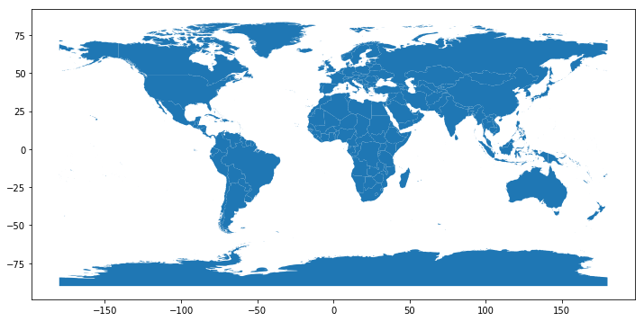


[top](#Table-of-Contents)
<a id='subselections'></a>
#### make sub-selections of a DataFrame
For example, if we only want the countries with the `CONTINENT` attribute of `Europe`, we can select those, assign them to a new variable, and even write them back out to disk as a GeoJSON:


```python
europe = countries.loc[countries['CONTINENT'] == 'Europe']
europe.head()
```


<div>
<style scoped>
    .dataframe tbody tr th:only-of-type {
        vertical-align: middle;
    }

    .dataframe tbody tr th {
        vertical-align: top;
    }

    .dataframe thead th {
        text-align: right;
    }
</style>
<table border="1" class="dataframe">
  <thead>
    <tr style="text-align: right;">
      <th></th>
      <th>featurecla</th>
      <th>scalerank</th>
      <th>LABELRANK</th>
      <th>SOVEREIGNT</th>
      <th>SOV_A3</th>
      <th>ADM0_DIF</th>
      <th>LEVEL</th>
      <th>TYPE</th>
      <th>ADMIN</th>
      <th>ADM0_A3</th>
      <th>...</th>
      <th>NAME_SV</th>
      <th>NAME_TR</th>
      <th>NAME_VI</th>
      <th>NAME_ZH</th>
      <th>FORMAL_FR</th>
      <th>NAME_ALT</th>
      <th>NOTE_ADM0</th>
      <th>NOTE_BRK</th>
      <th>BRK_GROUP</th>
      <th>geometry</th>
    </tr>
  </thead>
  <tbody>
    <tr>
      <th>5</th>
      <td>Admin-0 country</td>
      <td>6</td>
      <td>6</td>
      <td>Vatican</td>
      <td>VAT</td>
      <td>0</td>
      <td>2</td>
      <td>Sovereign country</td>
      <td>Vatican</td>
      <td>VAT</td>
      <td>...</td>
      <td>Vatikanstaten</td>
      <td>Vatikan</td>
      <td>Thành Vatican</td>
      <td>???</td>
      <td>None</td>
      <td>Holy See</td>
      <td>None</td>
      <td>None</td>
      <td>None</td>
      <td>POLYGON ((12.43916015625001 41.898388671875, 1...</td>
    </tr>
    <tr>
      <th>28</th>
      <td>Admin-0 country</td>
      <td>4</td>
      <td>6</td>
      <td>United Kingdom</td>
      <td>GB1</td>
      <td>1</td>
      <td>2</td>
      <td>Country</td>
      <td>Jersey</td>
      <td>JEY</td>
      <td>...</td>
      <td>Jersey</td>
      <td>Jersey</td>
      <td>Jersey</td>
      <td>???</td>
      <td>None</td>
      <td>None</td>
      <td>U.K. crown dependency</td>
      <td>None</td>
      <td>Channel Islands</td>
      <td>POLYGON ((-2.018652343749977 49.23125, -2.0099...</td>
    </tr>
    <tr>
      <th>29</th>
      <td>Admin-0 country</td>
      <td>4</td>
      <td>6</td>
      <td>United Kingdom</td>
      <td>GB1</td>
      <td>1</td>
      <td>2</td>
      <td>Country</td>
      <td>Guernsey</td>
      <td>GGY</td>
      <td>...</td>
      <td>Guernsey</td>
      <td>Guernsey</td>
      <td>Guernsey</td>
      <td>???</td>
      <td>None</td>
      <td>None</td>
      <td>U.K. crown dependency</td>
      <td>None</td>
      <td>Channel Islands</td>
      <td>POLYGON ((-2.512304687499977 49.49453125, -2.5...</td>
    </tr>
    <tr>
      <th>30</th>
      <td>Admin-0 country</td>
      <td>3</td>
      <td>6</td>
      <td>United Kingdom</td>
      <td>GB1</td>
      <td>1</td>
      <td>2</td>
      <td>Country</td>
      <td>Isle of Man</td>
      <td>IMN</td>
      <td>...</td>
      <td>Isle of Man</td>
      <td>Man Adas?</td>
      <td>??o Man</td>
      <td>???</td>
      <td>None</td>
      <td>None</td>
      <td>U.K. crown dependency</td>
      <td>None</td>
      <td>None</td>
      <td>POLYGON ((-4.412060546874983 54.1853515625, -4...</td>
    </tr>
    <tr>
      <th>31</th>
      <td>Admin-0 country</td>
      <td>1</td>
      <td>2</td>
      <td>United Kingdom</td>
      <td>GB1</td>
      <td>1</td>
      <td>2</td>
      <td>Country</td>
      <td>United Kingdom</td>
      <td>GBR</td>
      <td>...</td>
      <td>Storbritannien</td>
      <td>Birle?ik Krall?k</td>
      <td>V??ng qu?c Liên hi?p Anh và B?c Ireland</td>
      <td>??</td>
      <td>None</td>
      <td>None</td>
      <td>None</td>
      <td>None</td>
      <td>None</td>
      <td>(POLYGON ((-2.667675781249983 51.622998046875,...</td>
    </tr>
  </tbody>
</table>
<p>5 rows × 95 columns</p>
</div>


[top](#Table-of-Contents)
<a id='writesubselect'></a>
#### write sub-selection to shapefile


```python
europe.to_file('shapes/europe')
```

<a id='readshape1'></a>
#### read sub-selection from shapefile


```python
europe = gpd.read_file('./shapes/europe/europe.shp')
europe.head()
```


<div>
<style scoped>
    .dataframe tbody tr th:only-of-type {
        vertical-align: middle;
    }

    .dataframe tbody tr th {
        vertical-align: top;
    }

    .dataframe thead th {
        text-align: right;
    }
</style>
<table border="1" class="dataframe">
  <thead>
    <tr style="text-align: right;">
      <th></th>
      <th>featurecla</th>
      <th>scalerank</th>
      <th>LABELRANK</th>
      <th>SOVEREIGNT</th>
      <th>SOV_A3</th>
      <th>ADM0_DIF</th>
      <th>LEVEL</th>
      <th>TYPE</th>
      <th>ADMIN</th>
      <th>ADM0_A3</th>
      <th>...</th>
      <th>NAME_SV</th>
      <th>NAME_TR</th>
      <th>NAME_VI</th>
      <th>NAME_ZH</th>
      <th>FORMAL_FR</th>
      <th>NAME_ALT</th>
      <th>NOTE_ADM0</th>
      <th>NOTE_BRK</th>
      <th>BRK_GROUP</th>
      <th>geometry</th>
    </tr>
  </thead>
  <tbody>
    <tr>
      <th>0</th>
      <td>Admin-0 country</td>
      <td>6</td>
      <td>6</td>
      <td>Vatican</td>
      <td>VAT</td>
      <td>0</td>
      <td>2</td>
      <td>Sovereign country</td>
      <td>Vatican</td>
      <td>VAT</td>
      <td>...</td>
      <td>Vatikanstaten</td>
      <td>Vatikan</td>
      <td>Thành Vatican</td>
      <td>???</td>
      <td>None</td>
      <td>Holy See</td>
      <td>None</td>
      <td>None</td>
      <td>None</td>
      <td>POLYGON ((12.43916015625001 41.898388671875, 1...</td>
    </tr>
    <tr>
      <th>1</th>
      <td>Admin-0 country</td>
      <td>4</td>
      <td>6</td>
      <td>United Kingdom</td>
      <td>GB1</td>
      <td>1</td>
      <td>2</td>
      <td>Country</td>
      <td>Jersey</td>
      <td>JEY</td>
      <td>...</td>
      <td>Jersey</td>
      <td>Jersey</td>
      <td>Jersey</td>
      <td>???</td>
      <td>None</td>
      <td>None</td>
      <td>U.K. crown dependency</td>
      <td>None</td>
      <td>Channel Islands</td>
      <td>POLYGON ((-2.018652343749977 49.23125, -2.0099...</td>
    </tr>
    <tr>
      <th>2</th>
      <td>Admin-0 country</td>
      <td>4</td>
      <td>6</td>
      <td>United Kingdom</td>
      <td>GB1</td>
      <td>1</td>
      <td>2</td>
      <td>Country</td>
      <td>Guernsey</td>
      <td>GGY</td>
      <td>...</td>
      <td>Guernsey</td>
      <td>Guernsey</td>
      <td>Guernsey</td>
      <td>???</td>
      <td>None</td>
      <td>None</td>
      <td>U.K. crown dependency</td>
      <td>None</td>
      <td>Channel Islands</td>
      <td>POLYGON ((-2.512304687499977 49.49453125, -2.5...</td>
    </tr>
    <tr>
      <th>3</th>
      <td>Admin-0 country</td>
      <td>3</td>
      <td>6</td>
      <td>United Kingdom</td>
      <td>GB1</td>
      <td>1</td>
      <td>2</td>
      <td>Country</td>
      <td>Isle of Man</td>
      <td>IMN</td>
      <td>...</td>
      <td>Isle of Man</td>
      <td>Man Adas?</td>
      <td>??o Man</td>
      <td>???</td>
      <td>None</td>
      <td>None</td>
      <td>U.K. crown dependency</td>
      <td>None</td>
      <td>None</td>
      <td>POLYGON ((-4.412060546874983 54.1853515625, -4...</td>
    </tr>
    <tr>
      <th>4</th>
      <td>Admin-0 country</td>
      <td>1</td>
      <td>2</td>
      <td>United Kingdom</td>
      <td>GB1</td>
      <td>1</td>
      <td>2</td>
      <td>Country</td>
      <td>United Kingdom</td>
      <td>GBR</td>
      <td>...</td>
      <td>Storbritannien</td>
      <td>Birle?ik Krall?k</td>
      <td>V??ng qu?c Liên hi?p Anh và B?c Ireland</td>
      <td>??</td>
      <td>None</td>
      <td>None</td>
      <td>None</td>
      <td>None</td>
      <td>None</td>
      <td>(POLYGON ((-2.667675781249983 51.622998046875,...</td>
    </tr>
  </tbody>
</table>
<p>5 rows × 95 columns</p>
</div>


[top](#Table-of-Contents)
<a id='checkfile'></a>
#### check if json data file exist and delete if exist


```python
if os.path.exists('data/europe.json'):
  os.remove('data/europe.json')
```

[top](#Table-of-Contents)
<a id='writegeojson2'></a>
#### write sub-selection to geojson


```python
europe.to_file('./data/europe.json', driver='GeoJSON')
#Alternative write method -> with open('data/europe.json', 'w') as f: f.write(europe.to_json())
```

#### read the shapefile 


```python
europe = gpd.read_file('data/europe.json')
europe.plot(figsize=(15,15));
```


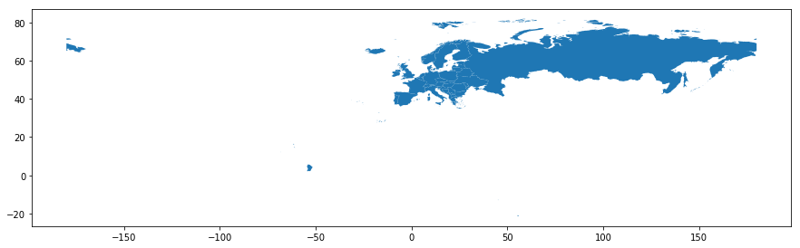


The output is not a particularly helpful visual (pretending that our intent is to focus on continental Europe):

[top](#Table-of-Contents)
<a id='setxyaxis'></a>
#### set X and Y axis limits with Matplotlib


```python
ax = europe.plot(figsize=(15,15))
ax.set(xlim=(-15,45), ylim=(30,73));
```


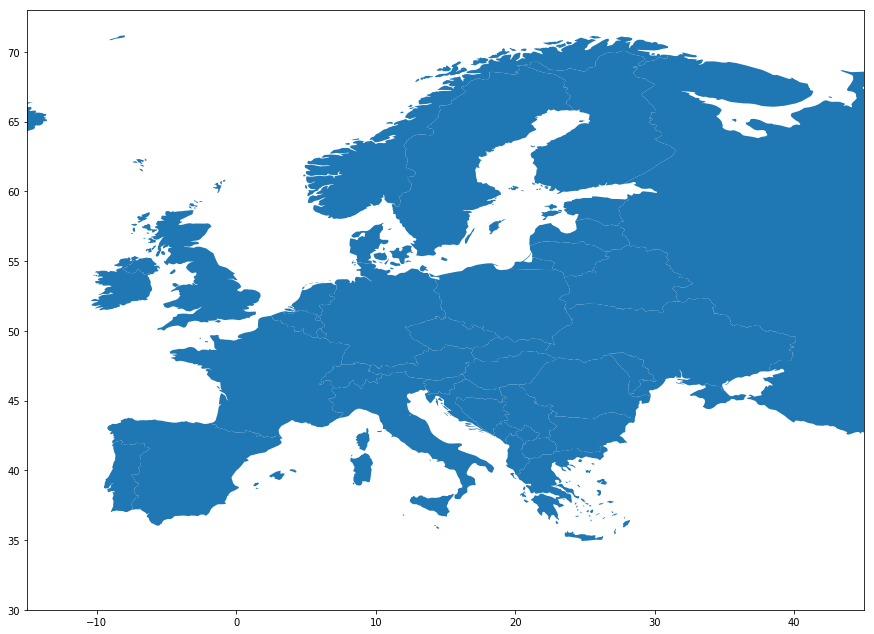


[top](#Table-of-Contents)
<a id='adjustproj'></a>
## Adjusting/managing projections

__Choose a country in Europe and get the projection__ from [EPSG.io](https://epsg.io/) This web site allows one to search for various map projections to obtain both their EPSG code (which GeoPandas handles as the preferred code) as well as the PROJ.4 definition.

<a id='setprojection'></a>
#### set dataframe to new projection


```python
europe.to_crs(epsg=3763, inplace=True)
europe.crs
```


    {'init': 'epsg:3763', 'no_defs': True}


```python
europe.plot(figsize=(15,15));
```


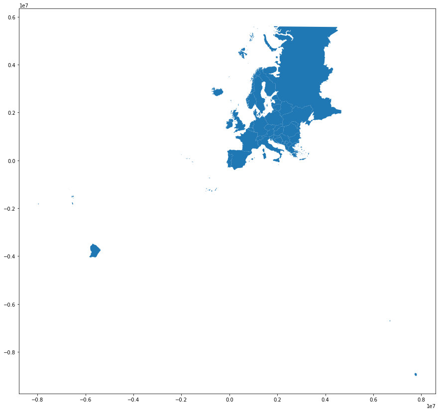


[top](#Table-of-Contents)
<a id='sliceportugal'></a>
#### create a new GeoDataFrame of Portugal
by slicing it from the europe GeoDataFrame (and remove Portugal from europe):


```python
portugal = europe[europe['ADMIN'] == "Portugal"]
europe = europe[europe['ADMIN'] != "Portugal"]
```

[top](#Table-of-Contents)
<a id='plotportugal'></a>
#### plot Portugal


```python
portugal.bounds
```


<div>
<style scoped>
    .dataframe tbody tr th:only-of-type {
        vertical-align: middle;
    }

    .dataframe tbody tr th {
        vertical-align: top;
    }

    .dataframe thead th {
        text-align: right;
    }
</style>
<table border="1" class="dataframe">
  <thead>
    <tr style="text-align: right;">
      <th></th>
      <th>minx</th>
      <th>miny</th>
      <th>maxx</th>
      <th>maxy</th>
    </tr>
  </thead>
  <tbody>
    <tr>
      <th>15</th>
      <td>-2.003758e+06</td>
      <td>-745274.483292</td>
      <td>160288.077944</td>
      <td>274212.075788</td>
    </tr>
  </tbody>
</table>
</div>


```python
portugal.plot(figsize=(15,15));
```


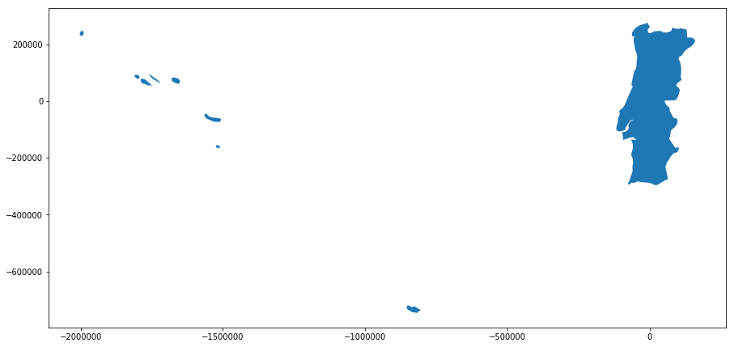


[top](#Table-of-Contents)
<a id='baseeurope'></a>
#### add the europe GeoDataFrame as the basemap  
plot Portugal on top of it, using some basic color properties to help create figure-ground  
adjust the axis limits using values of meters


```python
base = europe.plot(figsize=(12,12), edgecolor='white', color='#e9e9e9')
base.set(xlim=(-300000,1000000), ylim=(-500000, 500000))
portugal.plot(ax=base, color='#5496c2');
```


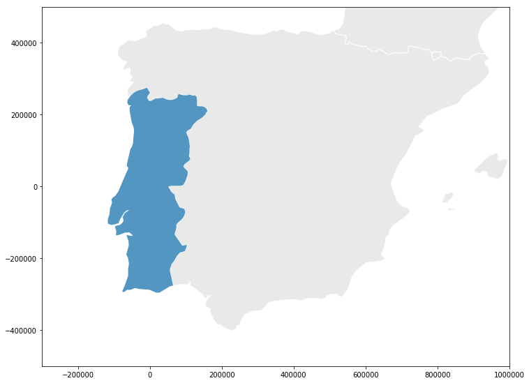


***
[top](#Table-of-Contents)
<a id='tilemaps'></a>
## Adding a background tile map to plots 
[GeoPandas 0.4.0 documentation](http://geopandas.org/gallery/plotting_basemap_background.html)


```python
%matplotlib inline

import pandas as pd
import geopandas as gpd
```

#### read data 


```python
europe = gpd.read_file('data/europe.json')
```

#### set dataframe to a target area (Portugal in this example)


```python
portugal = europe[europe['ADMIN'] == "Portugal"]
```

#### change crs to web mercator


```python
portugal.to_crs(epsg=3857, inplace=True)
portugal.crs
```


    {'init': 'epsg:3857', 'no_defs': True}


#### examine the area available for portugal


```python
portugal.plot(figsize=(10,10));
```


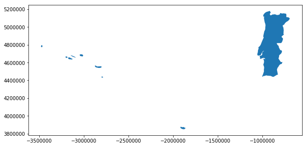


#### contextily helper function

Define a small helper function that uses `contextily <https://github.com/darribas/contextily>`  
to add a map as background to an existing plot: 


```python
import contextily as ctx

def add_basemap(ax, zoom, url='http://tile.stamen.com/terrain/tileZ/tileX/tileY.png'):
    xmin, xmax, ymin, ymax = ax.axis()
    basemap, extent = ctx.bounds2img(xmin, ymin, xmax, ymax, zoom=zoom, url=url)
    ax.imshow(basemap, extent=extent, interpolation='bilinear')
    # restore original x/y limits
    ax.axis((xmin, xmax, ymin, ymax))
```

#### a large area will take a longer time to load the basemap


```python
base = portugal.plot(figsize=(10, 15), alpha=0.4, edgecolor='k')
base.set(xlim=(-1500000,-500000), ylim=(4400000, 5200000))
add_basemap(ax=base, zoom=11)
```


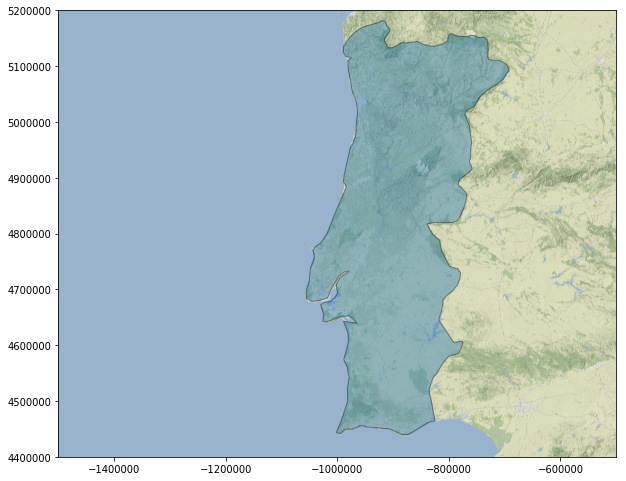


#### select a smaller area


```python
base = portugal.plot(figsize=(10,10), edgecolor='white', color='#e9e9e9')
base.set(xlim=(-1100000,-900000), ylim=(4600000, 4760000))
portugal.plot(ax=base, color='#5496c2')
```


    <matplotlib.axes._subplots.AxesSubplot at 0x1a277e24e0>


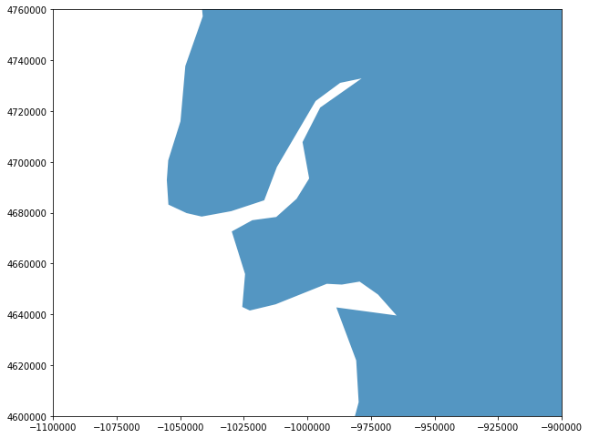


#### add in the basemap


```python
base = portugal.plot(figsize=(10, 15), alpha=0.09, edgecolor='k')
base.set(xlim=(-1060000,-991950), ylim=(4660000, 4705000))
add_basemap(ax=base, zoom=11)
```


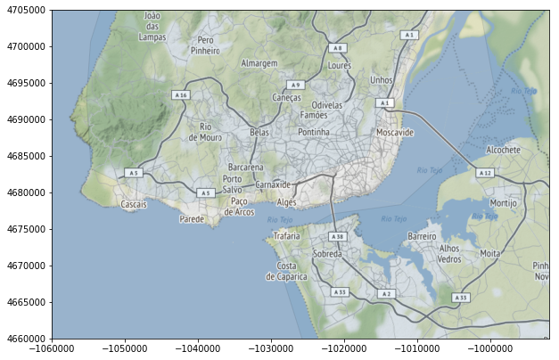


#### Portugual - the island of [Madeira](https://en.wikipedia.org/wiki/Madeira)


```python
base = portugal.plot(figsize=(10, 10), alpha=0.2, edgecolor='k')
base.set(xlim=(-1930000,-1850000), ylim=(3840000, 3881000))
add_basemap(ax=base, zoom=10)
```


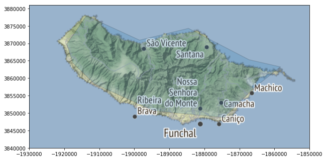


***
[top](#Table-of-Contents)
<a id='plotgeoplot'></a>
## Plotting with Geoplot and GeoPandas
[GeoPandas 0.4.0 documentation](http://geopandas.org/gallery/plotting_with_geoplot.html#sphx-glr-gallery-plotting-with-geoplot-py)


```python
countries = gpd.read_file('data/countries.json')
```

<a id='cartogram'></a>
#### use size as a visual variable using `cartogram`
Here are population estimates for countries in Africa.


```python
geoplot.cartogram(countries[countries['CONTINENT'] == 'Africa'], scale='POP_EST', limits=(0.2, 1), figsize=(7, 8));
```


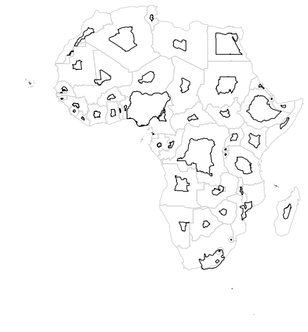


<a id='chloropleth'></a>
#### use color as a visual variable - specify choropleth
Here we sort population estimate by country into five buckets by color.


```python
geoplot.choropleth(countries[countries['CONTINENT'] == 'Africa'], hue='POP_EST', cmap='Greens', figsize=(7,8), legend=True);
```


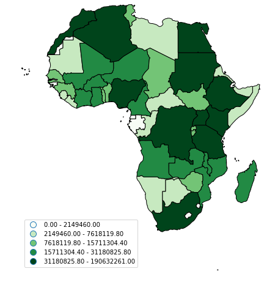


[top](#Table-of-Contents)
<a id='cartopy'></a>
## Re-project data into any of the map projections provided by CartoPy


```python
import geoplot
import geopandas

path = geopandas.datasets.get_path('naturalearth_lowres')
df = geopandas.read_file(path)
```

#### Start out by replicating the basic GeoPandas world plot using Geoplot.


```python
geoplot.polyplot(df, figsize=(12,6));
```


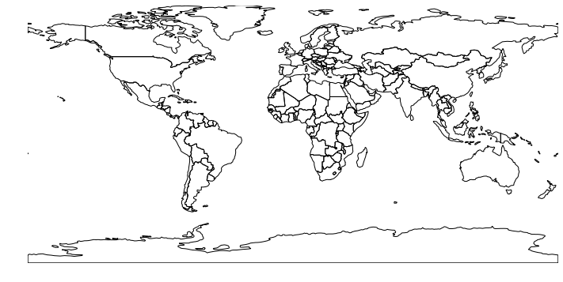


#### Orthographic


```python
import geoplot.crs as gcrs
ax = geoplot.polyplot(df, projection=gcrs.Orthographic(), figsize=(12,6))
ax.set_global()
ax.outline_patch.set_visible(True)
```


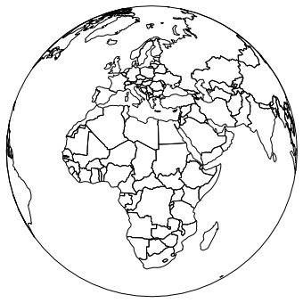


#### PlateCarree


```python
import geoplot.crs as gcrs
ax = geoplot.polyplot(df, projection=gcrs.PlateCarree(), figsize=(12, 6))

ax.coastlines(resolution='110m')
ax.gridlines()
ax.set_global()
ax.outline_patch.set_visible(True);
```


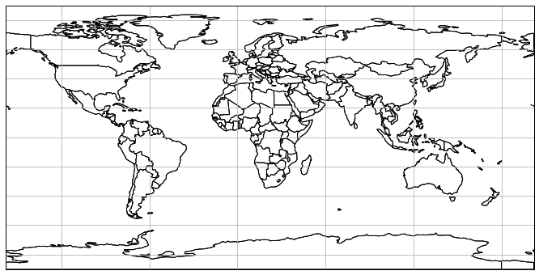


#### PlateCarree on 180 longitude


```python
ax = geoplot.polyplot(df, projection=gcrs.PlateCarree(central_longitude=180), figsize=(12, 6))
ax.coastlines(resolution='110m')
ax.gridlines()
ax.set_global()
ax.outline_patch.set_visible(True);
```


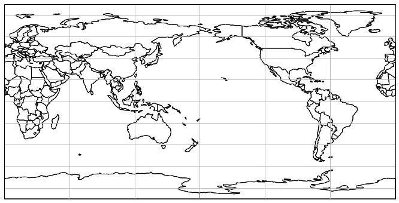


#### AlbersEqualArea


```python
ax = geoplot.polyplot(df, projection=gcrs.AlbersEqualArea(), figsize=(12, 6))
ax.coastlines(resolution='110m')
ax.gridlines()
ax.set_global()
ax.outline_patch.set_visible(True);
```


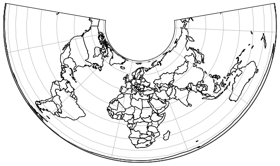


#### Robinson


```python
ax = geoplot.polyplot(df, projection=gcrs.Robinson(), figsize=(12, 6))
ax.coastlines(resolution='110m')
ax.gridlines()
ax.set_global()
ax.outline_patch.set_visible(True);
```


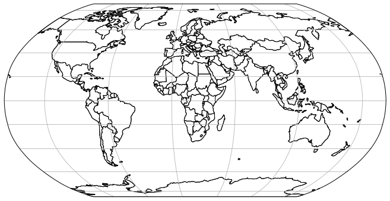


__see more 
[here](http://scitools.org.uk/cartopy/docs/latest/crs/projections.html)__

***

[top](#Table-of-Contents)
<a id='dissolve'></a>
## Aggregate geometric features
[GeoPandas 0.4.0 documentation](http://geopandas.org/aggregation_with_dissolve.html)

#### Geopandas `dissolve` function

dissolve can be thought of as doing three things:  
 (a) it dissolves all the geometries within a given group together into a single geometric feature (using the unary_union method), and  
 (b) it aggregates all the rows of data in a group using groupby.aggregate(), and  
 (c) it combines those two results.  


```python
%matplotlib inline

import pandas as pd
import geopandas as gpd
import matplotlib.pyplot as plt
plt.style.use('classic')
```

#### read in the countries json file made earlier


```python
countries = gpd.read_file('./data/countries.json')
```

[top](#Table-of-Contents)
<a id='aggcontinent'></a>
#### aggregate the geodataframe by continents


```python
continents = countries.dissolve(by='CONTINENT')
continents  # display the entire dataframe
```


<div>
<style scoped>
    .dataframe tbody tr th:only-of-type {
        vertical-align: middle;
    }

    .dataframe tbody tr th {
        vertical-align: top;
    }

    .dataframe thead th {
        text-align: right;
    }
</style>
<table border="1" class="dataframe">
  <thead>
    <tr style="text-align: right;">
      <th></th>
      <th>geometry</th>
      <th>featurecla</th>
      <th>scalerank</th>
      <th>LABELRANK</th>
      <th>SOVEREIGNT</th>
      <th>SOV_A3</th>
      <th>ADM0_DIF</th>
      <th>LEVEL</th>
      <th>TYPE</th>
      <th>ADMIN</th>
      <th>...</th>
      <th>NAME_RU</th>
      <th>NAME_SV</th>
      <th>NAME_TR</th>
      <th>NAME_VI</th>
      <th>NAME_ZH</th>
      <th>FORMAL_FR</th>
      <th>NAME_ALT</th>
      <th>NOTE_ADM0</th>
      <th>NOTE_BRK</th>
      <th>BRK_GROUP</th>
    </tr>
    <tr>
      <th>CONTINENT</th>
      <th></th>
      <th></th>
      <th></th>
      <th></th>
      <th></th>
      <th></th>
      <th></th>
      <th></th>
      <th></th>
      <th></th>
      <th></th>
      <th></th>
      <th></th>
      <th></th>
      <th></th>
      <th></th>
      <th></th>
      <th></th>
      <th></th>
      <th></th>
      <th></th>
    </tr>
  </thead>
  <tbody>
    <tr>
      <th>Africa</th>
      <td>(POLYGON ((37.85693359375 -46.94423828124999, ...</td>
      <td>Admin-0 country</td>
      <td>1</td>
      <td>3</td>
      <td>Zimbabwe</td>
      <td>ZWE</td>
      <td>0</td>
      <td>2</td>
      <td>Sovereign country</td>
      <td>Zimbabwe</td>
      <td>...</td>
      <td>????????</td>
      <td>Zimbabwe</td>
      <td>Zimbabve</td>
      <td>Zimbabwe</td>
      <td>???</td>
      <td>None</td>
      <td>None</td>
      <td>None</td>
      <td>None</td>
      <td>None</td>
    </tr>
    <tr>
      <th>Antarctica</th>
      <td>(POLYGON ((-147.58828125 -76.64980468750002, -...</td>
      <td>Admin-0 country</td>
      <td>3</td>
      <td>4</td>
      <td>Antarctica</td>
      <td>ATA</td>
      <td>0</td>
      <td>2</td>
      <td>Indeterminate</td>
      <td>Antarctica</td>
      <td>...</td>
      <td>??????????</td>
      <td>Antarktis</td>
      <td>Antarktika</td>
      <td>Châu Nam C?c</td>
      <td>???</td>
      <td>None</td>
      <td>None</td>
      <td>None</td>
      <td>Multiple claims held in abeyance</td>
      <td>None</td>
    </tr>
    <tr>
      <th>Asia</th>
      <td>(POLYGON ((96.91826171874999 -12.194140625, 96...</td>
      <td>Admin-0 country</td>
      <td>1</td>
      <td>3</td>
      <td>Yemen</td>
      <td>YEM</td>
      <td>0</td>
      <td>2</td>
      <td>Sovereign country</td>
      <td>Yemen</td>
      <td>...</td>
      <td>?????</td>
      <td>Jemen</td>
      <td>Yemen</td>
      <td>Yemen</td>
      <td>??</td>
      <td>None</td>
      <td>None</td>
      <td>None</td>
      <td>None</td>
      <td>None</td>
    </tr>
    <tr>
      <th>Europe</th>
      <td>(POLYGON ((55.79736328125 -21.33935546875, 55....</td>
      <td>Admin-0 country</td>
      <td>6</td>
      <td>6</td>
      <td>Vatican</td>
      <td>VAT</td>
      <td>0</td>
      <td>2</td>
      <td>Sovereign country</td>
      <td>Vatican</td>
      <td>...</td>
      <td>???????</td>
      <td>Vatikanstaten</td>
      <td>Vatikan</td>
      <td>Thành Vatican</td>
      <td>???</td>
      <td>None</td>
      <td>Holy See</td>
      <td>None</td>
      <td>None</td>
      <td>None</td>
    </tr>
    <tr>
      <th>North America</th>
      <td>(POLYGON ((-81.603271484375 7.332812499999989,...</td>
      <td>Admin-0 country</td>
      <td>3</td>
      <td>6</td>
      <td>United States of America</td>
      <td>US1</td>
      <td>1</td>
      <td>2</td>
      <td>Dependency</td>
      <td>United States Virgin Islands</td>
      <td>...</td>
      <td>???????????? ?????????? ???????</td>
      <td>Amerikanska Jungfruöarna</td>
      <td>ABD Virjin Adalar?</td>
      <td>Qu?n ??o Virgin thu?c M?</td>
      <td>???????</td>
      <td>None</td>
      <td>None</td>
      <td>U.S.A.</td>
      <td>None</td>
      <td>None</td>
    </tr>
    <tr>
      <th>Oceania</th>
      <td>(POLYGON ((158.87880859375 -54.70976562500002,...</td>
      <td>Admin-0 country</td>
      <td>1</td>
      <td>4</td>
      <td>Vanuatu</td>
      <td>VUT</td>
      <td>0</td>
      <td>2</td>
      <td>Sovereign country</td>
      <td>Vanuatu</td>
      <td>...</td>
      <td>???????</td>
      <td>Vanuatu</td>
      <td>Vanuatu</td>
      <td>Vanuatu</td>
      <td>???</td>
      <td>None</td>
      <td>None</td>
      <td>None</td>
      <td>None</td>
      <td>None</td>
    </tr>
    <tr>
      <th>Seven seas (open ocean)</th>
      <td>(POLYGON ((-26.26411132812498 -58.43515625, -2...</td>
      <td>Admin-0 country</td>
      <td>3</td>
      <td>4</td>
      <td>United Kingdom</td>
      <td>GB1</td>
      <td>1</td>
      <td>2</td>
      <td>Dependency</td>
      <td>South Georgia and the Islands</td>
      <td>...</td>
      <td>????? ??????? ? ????? ?????????? ???????</td>
      <td>Sydgeorgien och Sydsandwichöarna</td>
      <td>Güney Georgia ve Güney Sandwich Adalar?</td>
      <td>Nam Georgia và Qu?n ??o Nam Sandwich</td>
      <td>????????????</td>
      <td>None</td>
      <td>None</td>
      <td>U.K.</td>
      <td>None</td>
      <td>None</td>
    </tr>
    <tr>
      <th>South America</th>
      <td>(POLYGON ((-67.5751953125 -55.8896484375, -67....</td>
      <td>Admin-0 country</td>
      <td>5</td>
      <td>3</td>
      <td>Venezuela</td>
      <td>VEN</td>
      <td>0</td>
      <td>2</td>
      <td>Sovereign country</td>
      <td>Venezuela</td>
      <td>...</td>
      <td>?????????</td>
      <td>Venezuela</td>
      <td>Venezuela</td>
      <td>Venezuela</td>
      <td>????</td>
      <td>República Bolivariana de Venezuela</td>
      <td>None</td>
      <td>None</td>
      <td>None</td>
      <td>None</td>
    </tr>
  </tbody>
</table>
<p>8 rows × 94 columns</p>
</div>


[top](#Table-of-Contents)
<a id='plotnewgeo'></a>
#### Plot the new geodataframe


```python
continents.plot(figsize=(12, 6));
```


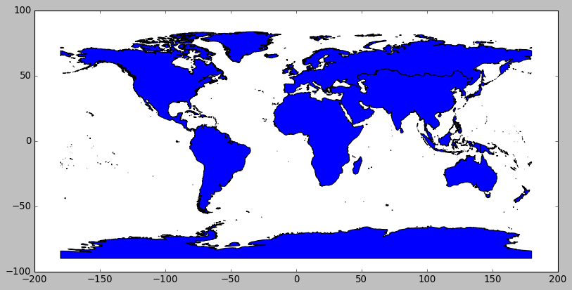


<a id='displegend'></a>
### Add color based on the pop_est for each continent; display legend to the right of the plot

The way color maps are scaled can also be manipulated with the `scheme` option (if you have pysal installed).   The `scheme` option, used below, can be set to ‘equal_interval’, ‘quantiles’ or ‘percentiles’.  

Colors are set with the `cmap` option [more info in this notebook](./colormap-reference-cmap.ipynb)


```python
fig, ax = plt.subplots(1, figsize=(12,6))
continents.plot(ax=ax, column = 'POP_EST', scheme='quantiles', cmap='YlOrRd', alpha=1, legend=True,
                            legend_kwds={'loc': 'upper left',
                                         'bbox_to_anchor': (1.0, 0.8, 0.2, 0.2),
                                         'title': 'Total Population', 
                                         'fontsize': 14,
                                         'frameon': False, });
```


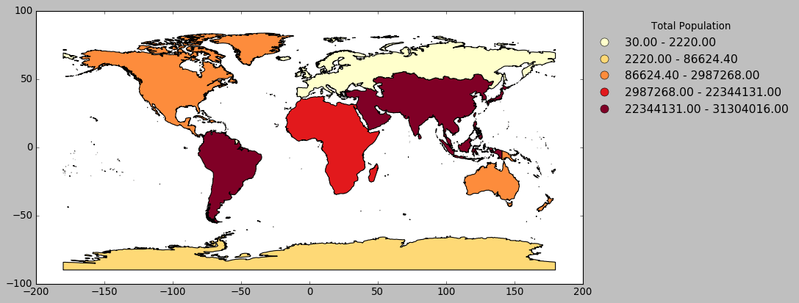


***
[top](#Table-of-Contents)


<a id='Creating_GeoDataFrame_DataFrame_with_coordinates'></a>  
## Creating a GeoDataFrame from a DataFrame with coordinates


```python
from shapely.geometry import Point
```

### From longitudes and latitudes
First, let’s consider a DataFrame containing residences and their respective longitudes and latitudes.


```python
import zipfile
# https://support.spatialkey.com/spatialkey-sample-csv-data/
zf = zipfile.ZipFile('./data/FL_insurance_sample.csv.zip') 
df = pd.read_csv(zf.open('FL_insurance_sample.csv'))
```


```python
df.head()
```


<div>
<style scoped>
    .dataframe tbody tr th:only-of-type {
        vertical-align: middle;
    }

    .dataframe tbody tr th {
        vertical-align: top;
    }

    .dataframe thead th {
        text-align: right;
    }
</style>
<table border="1" class="dataframe">
  <thead>
    <tr style="text-align: right;">
      <th></th>
      <th>policyID</th>
      <th>statecode</th>
      <th>county</th>
      <th>eq_site_limit</th>
      <th>hu_site_limit</th>
      <th>fl_site_limit</th>
      <th>fr_site_limit</th>
      <th>tiv_2011</th>
      <th>tiv_2012</th>
      <th>eq_site_deductible</th>
      <th>hu_site_deductible</th>
      <th>fl_site_deductible</th>
      <th>fr_site_deductible</th>
      <th>point_latitude</th>
      <th>point_longitude</th>
      <th>line</th>
      <th>construction</th>
      <th>point_granularity</th>
    </tr>
  </thead>
  <tbody>
    <tr>
      <th>0</th>
      <td>119736</td>
      <td>FL</td>
      <td>CLAY COUNTY</td>
      <td>498960.0</td>
      <td>498960.00</td>
      <td>498960.0</td>
      <td>498960.0</td>
      <td>498960.00</td>
      <td>792148.90</td>
      <td>0.0</td>
      <td>9979.2</td>
      <td>0.0</td>
      <td>0</td>
      <td>30.102261</td>
      <td>-81.711777</td>
      <td>Residential</td>
      <td>Masonry</td>
      <td>1</td>
    </tr>
    <tr>
      <th>1</th>
      <td>448094</td>
      <td>FL</td>
      <td>CLAY COUNTY</td>
      <td>1322376.3</td>
      <td>1322376.30</td>
      <td>1322376.3</td>
      <td>1322376.3</td>
      <td>1322376.30</td>
      <td>1438163.57</td>
      <td>0.0</td>
      <td>0.0</td>
      <td>0.0</td>
      <td>0</td>
      <td>30.063936</td>
      <td>-81.707664</td>
      <td>Residential</td>
      <td>Masonry</td>
      <td>3</td>
    </tr>
    <tr>
      <th>2</th>
      <td>206893</td>
      <td>FL</td>
      <td>CLAY COUNTY</td>
      <td>190724.4</td>
      <td>190724.40</td>
      <td>190724.4</td>
      <td>190724.4</td>
      <td>190724.40</td>
      <td>192476.78</td>
      <td>0.0</td>
      <td>0.0</td>
      <td>0.0</td>
      <td>0</td>
      <td>30.089579</td>
      <td>-81.700455</td>
      <td>Residential</td>
      <td>Wood</td>
      <td>1</td>
    </tr>
    <tr>
      <th>3</th>
      <td>333743</td>
      <td>FL</td>
      <td>CLAY COUNTY</td>
      <td>0.0</td>
      <td>79520.76</td>
      <td>0.0</td>
      <td>0.0</td>
      <td>79520.76</td>
      <td>86854.48</td>
      <td>0.0</td>
      <td>0.0</td>
      <td>0.0</td>
      <td>0</td>
      <td>30.063236</td>
      <td>-81.707703</td>
      <td>Residential</td>
      <td>Wood</td>
      <td>3</td>
    </tr>
    <tr>
      <th>4</th>
      <td>172534</td>
      <td>FL</td>
      <td>CLAY COUNTY</td>
      <td>0.0</td>
      <td>254281.50</td>
      <td>0.0</td>
      <td>254281.5</td>
      <td>254281.50</td>
      <td>246144.49</td>
      <td>0.0</td>
      <td>0.0</td>
      <td>0.0</td>
      <td>0</td>
      <td>30.060614</td>
      <td>-81.702675</td>
      <td>Residential</td>
      <td>Wood</td>
      <td>1</td>
    </tr>
  </tbody>
</table>
</div>


<a id='GeoDataFrame_needs_shapely_object'></a>
#### A GeoDataFrame needs a shapely object
**Create a new column Coordinates as a tuple of Longitude and Latitude :**


```python
df['Coordinates'] = list(zip(df.point_longitude, df.point_latitude))
```


```python
df['Coordinates'].head()
```


    0                     (-81.711777, 30.102261)
    1    (-81.70766400000001, 30.063935999999998)
    2            (-81.700455, 30.089578999999997)
    3             (-81.70770300000001, 30.063236)
    4                     (-81.702675, 30.060614)
    Name: Coordinates, dtype: object


<a id='transform_tuples'></a>
#### Transform tuples to Point :


```python
df['Coordinates'] = df['Coordinates'].apply(Point)
```

<a id='CreateGeoDataFrame'></a>
#### Create the GeoDataFrame by setting geometry with the coordinates created previously


```python
gdf = gpd.GeoDataFrame(df, geometry='Coordinates')
gdf.head()
```


<div>
<style scoped>
    .dataframe tbody tr th:only-of-type {
        vertical-align: middle;
    }

    .dataframe tbody tr th {
        vertical-align: top;
    }

    .dataframe thead th {
        text-align: right;
    }
</style>
<table border="1" class="dataframe">
  <thead>
    <tr style="text-align: right;">
      <th></th>
      <th>policyID</th>
      <th>statecode</th>
      <th>county</th>
      <th>eq_site_limit</th>
      <th>hu_site_limit</th>
      <th>fl_site_limit</th>
      <th>fr_site_limit</th>
      <th>tiv_2011</th>
      <th>tiv_2012</th>
      <th>eq_site_deductible</th>
      <th>hu_site_deductible</th>
      <th>fl_site_deductible</th>
      <th>fr_site_deductible</th>
      <th>point_latitude</th>
      <th>point_longitude</th>
      <th>line</th>
      <th>construction</th>
      <th>point_granularity</th>
      <th>Coordinates</th>
    </tr>
  </thead>
  <tbody>
    <tr>
      <th>0</th>
      <td>119736</td>
      <td>FL</td>
      <td>CLAY COUNTY</td>
      <td>498960.0</td>
      <td>498960.00</td>
      <td>498960.0</td>
      <td>498960.0</td>
      <td>498960.00</td>
      <td>792148.90</td>
      <td>0.0</td>
      <td>9979.2</td>
      <td>0.0</td>
      <td>0</td>
      <td>30.102261</td>
      <td>-81.711777</td>
      <td>Residential</td>
      <td>Masonry</td>
      <td>1</td>
      <td>POINT (-81.711777 30.102261)</td>
    </tr>
    <tr>
      <th>1</th>
      <td>448094</td>
      <td>FL</td>
      <td>CLAY COUNTY</td>
      <td>1322376.3</td>
      <td>1322376.30</td>
      <td>1322376.3</td>
      <td>1322376.3</td>
      <td>1322376.30</td>
      <td>1438163.57</td>
      <td>0.0</td>
      <td>0.0</td>
      <td>0.0</td>
      <td>0</td>
      <td>30.063936</td>
      <td>-81.707664</td>
      <td>Residential</td>
      <td>Masonry</td>
      <td>3</td>
      <td>POINT (-81.70766400000001 30.063936)</td>
    </tr>
    <tr>
      <th>2</th>
      <td>206893</td>
      <td>FL</td>
      <td>CLAY COUNTY</td>
      <td>190724.4</td>
      <td>190724.40</td>
      <td>190724.4</td>
      <td>190724.4</td>
      <td>190724.40</td>
      <td>192476.78</td>
      <td>0.0</td>
      <td>0.0</td>
      <td>0.0</td>
      <td>0</td>
      <td>30.089579</td>
      <td>-81.700455</td>
      <td>Residential</td>
      <td>Wood</td>
      <td>1</td>
      <td>POINT (-81.70045500000001 30.089579)</td>
    </tr>
    <tr>
      <th>3</th>
      <td>333743</td>
      <td>FL</td>
      <td>CLAY COUNTY</td>
      <td>0.0</td>
      <td>79520.76</td>
      <td>0.0</td>
      <td>0.0</td>
      <td>79520.76</td>
      <td>86854.48</td>
      <td>0.0</td>
      <td>0.0</td>
      <td>0.0</td>
      <td>0</td>
      <td>30.063236</td>
      <td>-81.707703</td>
      <td>Residential</td>
      <td>Wood</td>
      <td>3</td>
      <td>POINT (-81.70770300000001 30.063236)</td>
    </tr>
    <tr>
      <th>4</th>
      <td>172534</td>
      <td>FL</td>
      <td>CLAY COUNTY</td>
      <td>0.0</td>
      <td>254281.50</td>
      <td>0.0</td>
      <td>254281.5</td>
      <td>254281.50</td>
      <td>246144.49</td>
      <td>0.0</td>
      <td>0.0</td>
      <td>0.0</td>
      <td>0</td>
      <td>30.060614</td>
      <td>-81.702675</td>
      <td>Residential</td>
      <td>Wood</td>
      <td>1</td>
      <td>POINT (-81.702675 30.060614)</td>
    </tr>
  </tbody>
</table>
</div>


#### increase decrease in total insured value (tiv)


```python
gdf['tiv_total_inc_dec'] = gdf['tiv_2012'] - gdf['tiv_2011']
```


```python
gdf.head()
```


<div>
<style scoped>
    .dataframe tbody tr th:only-of-type {
        vertical-align: middle;
    }

    .dataframe tbody tr th {
        vertical-align: top;
    }

    .dataframe thead th {
        text-align: right;
    }
</style>
<table border="1" class="dataframe">
  <thead>
    <tr style="text-align: right;">
      <th></th>
      <th>policyID</th>
      <th>statecode</th>
      <th>county</th>
      <th>eq_site_limit</th>
      <th>hu_site_limit</th>
      <th>fl_site_limit</th>
      <th>fr_site_limit</th>
      <th>tiv_2011</th>
      <th>tiv_2012</th>
      <th>eq_site_deductible</th>
      <th>hu_site_deductible</th>
      <th>fl_site_deductible</th>
      <th>fr_site_deductible</th>
      <th>point_latitude</th>
      <th>point_longitude</th>
      <th>line</th>
      <th>construction</th>
      <th>point_granularity</th>
      <th>Coordinates</th>
      <th>tiv_total_inc_dec</th>
    </tr>
  </thead>
  <tbody>
    <tr>
      <th>0</th>
      <td>119736</td>
      <td>FL</td>
      <td>CLAY COUNTY</td>
      <td>498960.0</td>
      <td>498960.00</td>
      <td>498960.0</td>
      <td>498960.0</td>
      <td>498960.00</td>
      <td>792148.90</td>
      <td>0.0</td>
      <td>9979.2</td>
      <td>0.0</td>
      <td>0</td>
      <td>30.102261</td>
      <td>-81.711777</td>
      <td>Residential</td>
      <td>Masonry</td>
      <td>1</td>
      <td>POINT (-81.711777 30.102261)</td>
      <td>293188.90</td>
    </tr>
    <tr>
      <th>1</th>
      <td>448094</td>
      <td>FL</td>
      <td>CLAY COUNTY</td>
      <td>1322376.3</td>
      <td>1322376.30</td>
      <td>1322376.3</td>
      <td>1322376.3</td>
      <td>1322376.30</td>
      <td>1438163.57</td>
      <td>0.0</td>
      <td>0.0</td>
      <td>0.0</td>
      <td>0</td>
      <td>30.063936</td>
      <td>-81.707664</td>
      <td>Residential</td>
      <td>Masonry</td>
      <td>3</td>
      <td>POINT (-81.70766400000001 30.063936)</td>
      <td>115787.27</td>
    </tr>
    <tr>
      <th>2</th>
      <td>206893</td>
      <td>FL</td>
      <td>CLAY COUNTY</td>
      <td>190724.4</td>
      <td>190724.40</td>
      <td>190724.4</td>
      <td>190724.4</td>
      <td>190724.40</td>
      <td>192476.78</td>
      <td>0.0</td>
      <td>0.0</td>
      <td>0.0</td>
      <td>0</td>
      <td>30.089579</td>
      <td>-81.700455</td>
      <td>Residential</td>
      <td>Wood</td>
      <td>1</td>
      <td>POINT (-81.70045500000001 30.089579)</td>
      <td>1752.38</td>
    </tr>
    <tr>
      <th>3</th>
      <td>333743</td>
      <td>FL</td>
      <td>CLAY COUNTY</td>
      <td>0.0</td>
      <td>79520.76</td>
      <td>0.0</td>
      <td>0.0</td>
      <td>79520.76</td>
      <td>86854.48</td>
      <td>0.0</td>
      <td>0.0</td>
      <td>0.0</td>
      <td>0</td>
      <td>30.063236</td>
      <td>-81.707703</td>
      <td>Residential</td>
      <td>Wood</td>
      <td>3</td>
      <td>POINT (-81.70770300000001 30.063236)</td>
      <td>7333.72</td>
    </tr>
    <tr>
      <th>4</th>
      <td>172534</td>
      <td>FL</td>
      <td>CLAY COUNTY</td>
      <td>0.0</td>
      <td>254281.50</td>
      <td>0.0</td>
      <td>254281.5</td>
      <td>254281.50</td>
      <td>246144.49</td>
      <td>0.0</td>
      <td>0.0</td>
      <td>0.0</td>
      <td>0</td>
      <td>30.060614</td>
      <td>-81.702675</td>
      <td>Residential</td>
      <td>Wood</td>
      <td>1</td>
      <td>POINT (-81.702675 30.060614)</td>
      <td>-8137.01</td>
    </tr>
  </tbody>
</table>
</div>


#### Request the state outline shapefile


```python
states_raw = gpd.read_file('http://www2.census.gov/geo/tiger/GENZ2017/shp/cb_2017_us_state_5m.zip')
```


```python
states_raw.head()
```


<div>
<style scoped>
    .dataframe tbody tr th:only-of-type {
        vertical-align: middle;
    }

    .dataframe tbody tr th {
        vertical-align: top;
    }

    .dataframe thead th {
        text-align: right;
    }
</style>
<table border="1" class="dataframe">
  <thead>
    <tr style="text-align: right;">
      <th></th>
      <th>STATEFP</th>
      <th>STATENS</th>
      <th>AFFGEOID</th>
      <th>GEOID</th>
      <th>STUSPS</th>
      <th>NAME</th>
      <th>LSAD</th>
      <th>ALAND</th>
      <th>AWATER</th>
      <th>geometry</th>
    </tr>
  </thead>
  <tbody>
    <tr>
      <th>0</th>
      <td>01</td>
      <td>01779775</td>
      <td>0400000US01</td>
      <td>01</td>
      <td>AL</td>
      <td>Alabama</td>
      <td>00</td>
      <td>131174431216</td>
      <td>4592944701</td>
      <td>(POLYGON ((-88.04374299999999 30.517423, -88.0...</td>
    </tr>
    <tr>
      <th>1</th>
      <td>02</td>
      <td>01785533</td>
      <td>0400000US02</td>
      <td>02</td>
      <td>AK</td>
      <td>Alaska</td>
      <td>00</td>
      <td>1478588231566</td>
      <td>277723861311</td>
      <td>(POLYGON ((-150.242099 61.137835, -150.228774 ...</td>
    </tr>
    <tr>
      <th>2</th>
      <td>04</td>
      <td>01779777</td>
      <td>0400000US04</td>
      <td>04</td>
      <td>AZ</td>
      <td>Arizona</td>
      <td>00</td>
      <td>294198661567</td>
      <td>1027245114</td>
      <td>POLYGON ((-114.799683 32.593621, -114.809393 3...</td>
    </tr>
    <tr>
      <th>3</th>
      <td>08</td>
      <td>01779779</td>
      <td>0400000US08</td>
      <td>08</td>
      <td>CO</td>
      <td>Colorado</td>
      <td>00</td>
      <td>268425964573</td>
      <td>1178495763</td>
      <td>POLYGON ((-109.060253 38.599328, -109.059541 3...</td>
    </tr>
    <tr>
      <th>4</th>
      <td>12</td>
      <td>00294478</td>
      <td>0400000US12</td>
      <td>12</td>
      <td>FL</td>
      <td>Florida</td>
      <td>00</td>
      <td>138911437206</td>
      <td>31398800291</td>
      <td>(POLYGON ((-80.751643 24.857254, -80.729063 24...</td>
    </tr>
  </tbody>
</table>
</div>


#### restrict data to the state of Florda


```python
florida = states_raw.loc[states_raw['STATEFP'] == '12']
```

<a id='plot_geodataframe'></a>
#### plot geodataframe coordinates over a state-level map of Florida


```python
ax = florida.plot(figsize=(15,15), color='white', edgecolor='black');
gdf.plot(ax=ax, linewidth=0.25, edgecolor='white', markersize=3.0, alpha=0.5, color='blue');

```


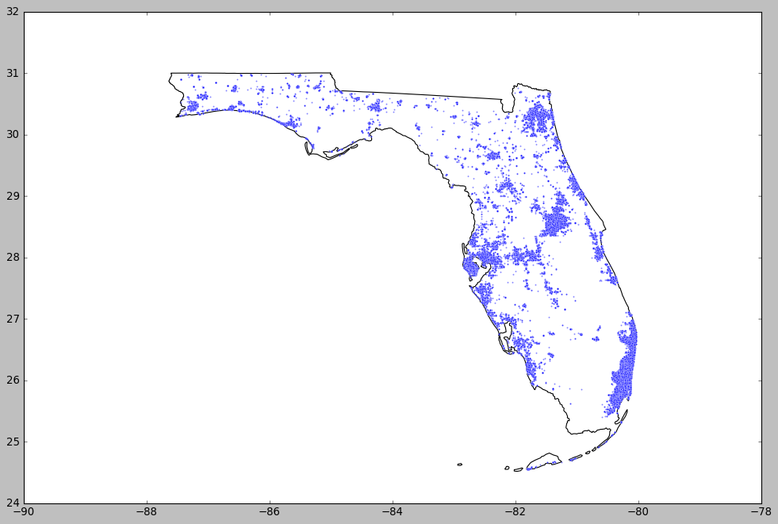


<a id='plot_column'></a>
#### plot a specific column
using the total insured value increase-decrease created above


```python
ax = florida.plot(figsize=(15,15), color='white', edgecolor='black');
gdf.plot(ax=ax, linewidth=0.0, markersize=5.0, column = 'tiv_total_inc_dec', 
         scheme='quantiles', cmap='YlOrRd', alpha=1.0, legend=True,
                            legend_kwds={'loc': 'center left',
                                         'title': 'Total Population', 
                                         'fontsize': 14,
                                         'frameon': False, });
```


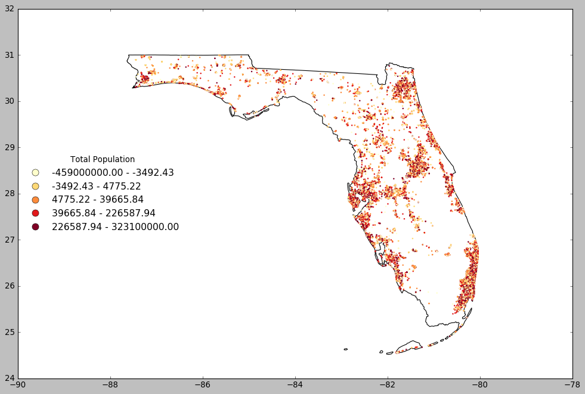


***
[top](#Table-of-Contents)
